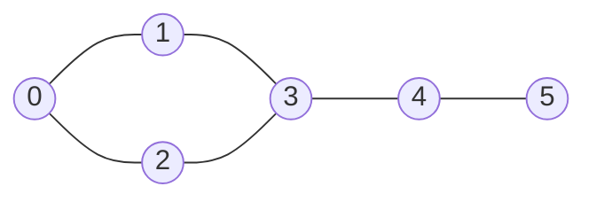

# 🌐 Optimized Vertex Cover

A C++ implementation of a **greedy vertex-cover approach** for a graph representing fields and their water connections. The algorithm selects both endpoints of an uncovered edge and marks them as covered.

## 🖼️ Graph View



## 🧠 How It Works

For every edge `(u, v)`:

- If neither endpoint has been selected, both vertices are added to the cover.
- Selected vertices are marked so later edges can be skipped when already covered.
- The program prints the selected irrigation points.

The sample graph contains **6 vertices** and represents connections between fields.

> This is a greedy approximation-style approach; it is not presented as an exact minimum-vertex-cover solver for arbitrary graphs.

## 🧰 Technology


## 🚀 Compile & Run

```bash
g++ Vertex-cover.cpp -o vertex-cover
./vertex-cover
```

## 📌 Status

Completed algorithm practice project.

## 👨‍💻 Author

**Dreamjain** — [GitHub](https://github.com/Dreamjain)
