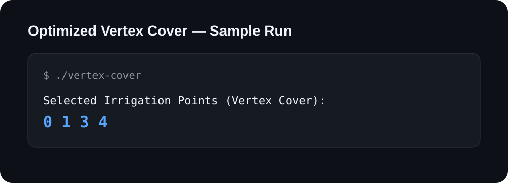

# 🌐 Optimized Vertex Cover

A C++ implementation of a **greedy vertex-cover algorithm** for a graph representing fields and their water connections. The project focuses on graph traversal, coverage tracking, and a practical approximation strategy.

## 🎯 Problem

Given an undirected graph, select a set of vertices such that every edge has at least one selected endpoint. This implementation uses a greedy strategy rather than an exact minimum-vertex-cover solver.

## 🧠 Approach

For every edge `(u, v)`:

1. Check whether either endpoint has already been selected.
2. If neither endpoint is selected, add both vertices to the cover.
3. Mark selected vertices so subsequent edges can reuse them.
4. Print the resulting cover.

For the included sample graph, the algorithm selects **0, 1, 3, 4**.

> **Engineering note:** this greedy strategy is intentionally simple and is not guaranteed to produce the minimum vertex cover for arbitrary graphs.

## 🖼️ Actual Program Output

The visual below records the output produced by the repository's sample program:



## 📊 Complexity

With the current edge-list implementation, the traversal is **O(E)** time and **O(V)** auxiliary space for the selected/visited state.

## 🧰 Technology


## 🚀 Compile & Run

```bash
g++ -std=c++17 -Wall -Wextra Vertex-cover.cpp -o vertex-cover
./vertex-cover
```

Expected output:

```text
Selected Irrigation Points (Vertex Cover): 0 1 3 4
```

## 📌 Status

Completed algorithm engineering project.

## 👨‍💻 Author

**Dreamjain** — [GitHub](https://github.com/Dreamjain)
